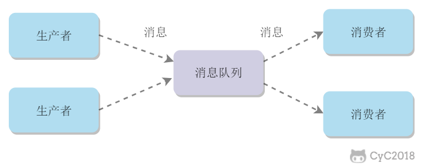

<!-- @import "[TOC]" {cmd="toc" depthFrom=1 depthTo=6 orderedList=false} -->

<!-- code_chunk_output -->

- [〇、 概念](#〇-概念)
  - [什么是消息队列？](#什么是消息队列)
- [一、消息模型](#一-消息模型)
  - [点对点](#点对点)
  - [发布/订阅](#发布订阅)
- [二、使用场景](#二-使用场景)
  - [异步处理](#异步处理)
  - [流量削锋](#流量削锋)
  - [应用解耦](#应用解耦)
- [三、可靠性](#三-可靠性)
  - [发送端的可靠性](#发送端的可靠性)
  - [接收端的可靠性](#接收端的可靠性)
- [参考资料](#参考资料)

<!-- /code_chunk_output -->

# 〇、 概念

## 什么是消息队列？

> 消息队列，简称它为MQ(Message Queue),

消息队列可以简单理解为：**把要传输的数据放在队列中**。

<div align="center">  </div><br>
科普：

- 把数据放到消息队列叫做**生产者**
- 从消息队列里边取数据叫做**消费者**

# 一、消息模型

## 点对点

消息生产者向消息队列中发送了一个消息之后，只能被一个消费者消费一次。

<div align="center">  </div><br>
## 发布/订阅

消息生产者向频道发送一个消息之后，多个消费者可以从该频道订阅到这条消息并消费。

<div align="center">  </div><br>
发布与订阅模式和观察者模式有以下不同：

- 观察者模式中，观察者和主题都知道对方的存在；而在发布与订阅模式中，生产者与消费者不知道对方的存在，它们之间通过频道进行通信。
- 观察者模式是同步的，当事件触发时，主题会调用观察者的方法，然后等待方法返回；而发布与订阅模式是异步的，生产者向频道发送一个消息之后，就不需要关心消费者何时去订阅这个消息，可以立即返回。

<div align="center">  </div><br>
# 二、使用场景

## 异步处理

发送者将消息发送给消息队列之后，不需要同步等待消息接收者处理完毕，而是立即返回进行其它操作。消息接收者从消息队列中订阅消息之后异步处理。

我们再来看看下面这种情况：系统A还是**直接调用**系统B、C、D

<div align="center">  </div><br>
代码如下：

```java
public class SystemA {

    SystemB systemB = new SystemB();
    SystemC systemC = new SystemC();
    SystemD systemD = new SystemD();

    // 系统A独有的数据
    private String userId ;

    public void doOrder() {

        // 下订单
          userId = this.order();
        // 如果下单成功，则安排其他系统做一些事  
        systemB.SystemBNeed2do(userId);
        systemC.SystemCNeed2do(userId);
        systemD.SystemDNeed2do(userId);

    }
}

```

**假设**系统A运算出userId具体的值需要50ms，调用系统B的接口需要300ms，调用系统C的接口需要300ms，调用系统D的接口需要300ms。那么这次请求就需要`50+300+300+300=950ms`

并且我们得知，系统A做的是**主要的业务**，而系统B、C、D是**非主要**的业务。比如系统A处理的是**订单下单**，而系统B是订单下单成功了，那发送一条短信告诉具体的用户此订单已成功，而系统C和系统D也是处理一些小事而已。

那么此时，为了**提高用户体验和吞吐量**，其实可以**异步地**调用系统B、C、D的接口。所以，我们可以弄成是这样的：

<div align="center">  </div><br>
系统A执行完了以后，将userId写到消息队列中，然后就直接返回了(至于其他的操作，则异步处理)。

- 本来整个请求需要用950ms(同步)
- 现在将调用其他系统接口异步化，从请求到返回只需要100ms(异步)

例如：在注册流程中通常需要发送验证邮件来确保注册用户身份的合法性，可以使用消息队列使发送验证邮件的操作异步处理，用户在填写完注册信息之后就可以完成注册，而将发送验证邮件这一消息发送到消息队列中。

只有在业务流程允许异步处理的情况下才能这么做，例如上面的注册流程中，如果要求用户对验证邮件进行点击之后才能完成注册的话，就不能再使用消息队列。

## 流量削锋

在高并发的场景下，如果短时间有大量的请求到达会压垮服务器。

可以将请求发送到消息队列中，服务器按照其处理能力从消息队列中订阅消息进行处理。

在现在的系统视线中，MQ消息队列是普遍使用的，可以完美的解决这些问题的利器。下图是使用了MQ的简单架构图，可以看到MQ在最前端对流量进行蓄洪，下游的系统ABC只与MQ打交道，通过事先定义好的消息格式来解析。

  <div align="center">  </div><br>
## 应用解耦

现在我有一个系统A，系统A可以产生一个`userId`，然后，现在有系统B和系统C都需要这个`userId`去做相关的操作。

<div align="center">  </div><br>
某一天，系统B的负责人告诉系统A的负责人，现在系统B的`SystemBNeed2do(String userId)`这个接口不再使用了，**让系统A别去调它了**。

又过了几天，系统D的负责人接了个需求，也需要用到系统A的userId，于是就跑去跟系统A的负责人说："老哥，我要用到你的userId，你调一下我的接口吧"

于是系统A说："没问题的，这就搞"

<div align="center">  </div><br>
时间飞逝：

- 又过了几天，系统E的负责人过来了，告诉系统A，需要userId。
- 又过了几天，系统B的负责人过来了，告诉系统A，还是重新掉那个接口吧。
- 又过了几天，系统F的负责人过来了，告诉系统A，需要userId。
- ……

于是系统A的负责人，每天都被这给骚扰着，改来改去，改来改去…….

还有另外一个问题，调用系统C的时候，如果系统C挂了，系统A还得想办法处理。如果调用系统D时，由于网络延迟，请求超时了，那系统A是反馈`fail`还是重试？？

最后，系统A的负责人，觉得**隔一段时间就改来改去**，没意思，于是就跑路了。

然后，公司招来一个大佬，大佬经过几天熟悉，上来就说：**将系统A的userId写到消息队列中，这样系统A就不用经常改动了**。为什么呢？下面我们来一起看看：

<div align="center">  </div><br>
系统A将userId写到消息队列中，系统C和系统D从消息队列中拿数据。**这样有什么好处**？

- 系统A**只负责**把数据写到队列中，谁想要或不想要这个数据(消息)，**系统A一点都不关心**。
- 即便现在系统D不想要userId这个数据了，系统B又突然想要userId这个数据了，都跟系统A无关，系统A一点代码都不用改。
- 系统D拿userId不再经过系统A，而是从消息队列里边拿。**系统D即便挂了或者请求超时，都跟系统A无关，只跟消息队列有关**。

这样一来，系统A与系统B、C、D都**解耦**了。

如果模块之间不直接进行调用，模块之间耦合度就会很低，那么修改一个模块或者新增一个模块对其它模块的影响会很小，从而实现可扩展性。

通过使用消息队列，一个模块只需要向消息队列中发送消息，其它模块可以选择性地从消息队列中订阅消息从而完成调用。

# 三、可靠性

## 发送端的可靠性

发送端完成操作后一定能将消息成功发送到消息队列中。

实现方法：**在本地数据库建一张消息表，将消息数据与业务数据保存在同一数据库实例里，这样就可以利用本地数据库的事务机制。事务提交成功后，将消息表中的消息转移到消息队列中，若转移消息成功则删除消息表中的数据，否则继续重传。**

## 接收端的可靠性

接收端能够从消息队列成功消费一次消息。

两种实现方法：

- 保证接收端处理消息的业务逻辑具有幂等性：只要具有幂等性，那么消费多少次消息，最后处理的结果都是一样的。
- 保证消息具有唯一编号，并使用一张日志表来记录已经消费的消息编号。

# 参考资料

- [Observer vs Pub-Sub](http://developers-club.com/posts/270339/)
- [消息队列中点对点与发布订阅区别](https://blog.csdn.net/lizhitao/article/details/47723105)

+ [为什么要使用MQ消息中间件？](https://mp.weixin.qq.com/s/ACaDzsdcezDdmI2F5Pqj6w)
+ [面试官问你什么是消息队列？](https://mp.weixin.qq.com/s/h0kc2sMT5b2Y3Zpkq5figg)