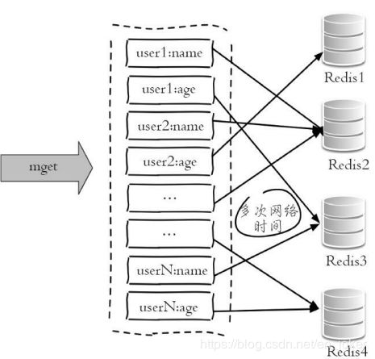
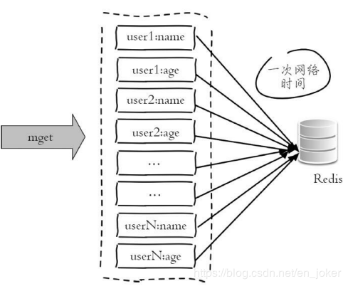
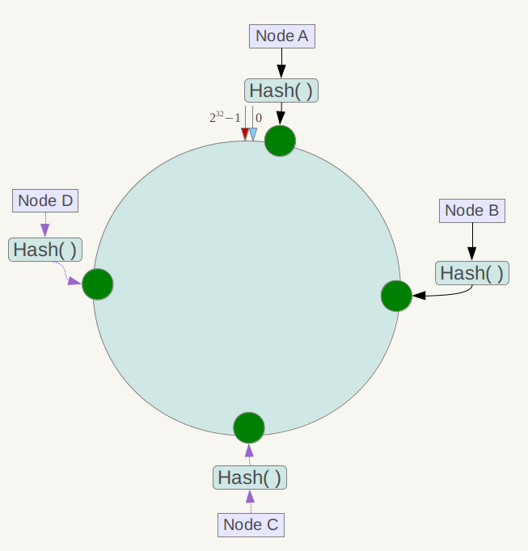
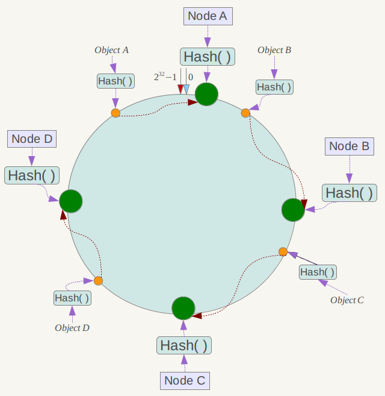
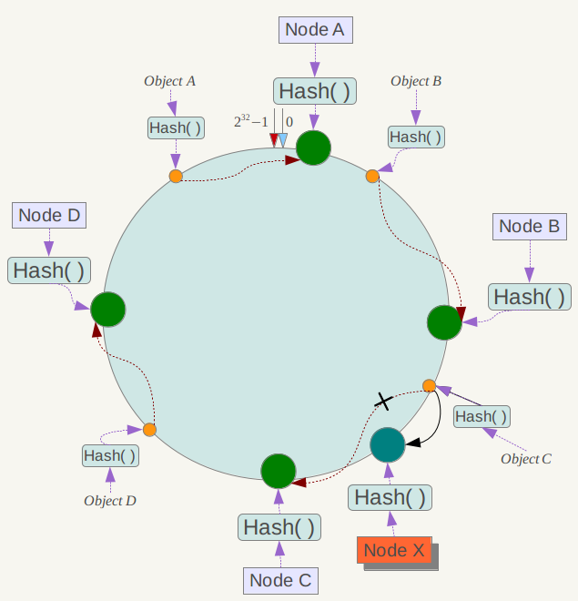
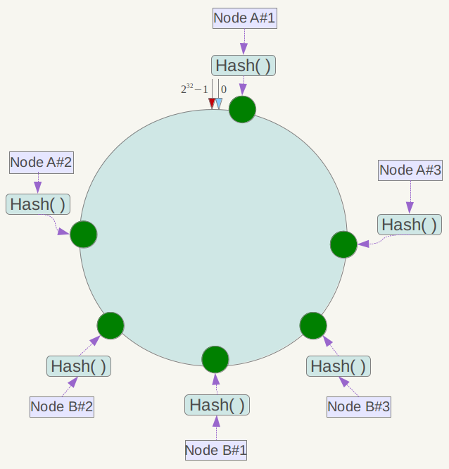

<!-- GFM-TOC -->

* [一、缓存特征](#一缓存特征)
* [二、LRU](#二lru)
* [三、缓存位置](#三缓存位置)
* [四、CDN](#四cdn)
* [五、缓存问题](#五缓存问题)
* [六、数据分布](#六数据分布)
* [七、一致性哈希](#七一致性哈希)
* [参考资料](#参考资料)
<!-- GFM-TOC -->


# 一、缓存特征

## 命中率

当某个请求能够通过访问缓存而得到响应时，称为缓存命中。

缓存命中率越高，缓存的利用率也就越高。

## 最大空间

缓存通常位于内存中，内存的空间通常比磁盘空间小的多，因此缓存的最大空间不可能非常大。

当缓存存放的数据量超过最大空间时，就需要淘汰部分数据来存放新到达的数据。

## 淘汰策略

- FIFO（First In First Out）：先进先出策略，在实时性的场景下，需要经常访问最新的数据，那么就可以使用 FIFO，使得最先进入的数据（最晚的数据）被淘汰。

- LRU（Least Recently Used）：最近最久未使用策略，优先淘汰最久未使用的数据，也就是上次被访问时间距离现在最久的数据。该策略可以保证内存中的数据都是热点数据，也就是经常被访问的数据，从而保证缓存命中率。

- LFU（Least Frequently Used）：最不经常使用策略，优先淘汰一段时间内使用次数最少的数据。

# 二、LRU

以下是基于 双向链表 + HashMap 的 LRU 算法实现，对算法的解释如下：

- 访问某个节点时，将其从原来的位置删除，并重新插入到链表头部。这样就能保证链表尾部存储的就是最近最久未使用的节点，当节点数量大于缓存最大空间时就淘汰链表尾部的节点。
- 为了使删除操作时间复杂度为 O(1)，就不能采用遍历的方式找到某个节点。HashMap 存储着 Key 到节点的映射，通过 Key 就能以 O(1) 的时间得到节点，然后再以 O(1) 的时间将其从双向队列中删除。

```java
public class LRU<K, V> implements Iterable<K> {

    private Node head;
    private Node tail;
    private HashMap<K, Node> map;
    private int maxSize;

    private class Node {

        Node pre;
        Node next;
        K k;
        V v;

        public Node(K k, V v) {
            this.k = k;
            this.v = v;
        }
    }


    public LRU(int maxSize) {

        this.maxSize = maxSize;
        this.map = new HashMap<>(maxSize * 4 / 3);

        head = new Node(null, null);
        tail = new Node(null, null);

        head.next = tail;
        tail.pre = head;
    }


    public V get(K key) {

        if (!map.containsKey(key)) {
            return null;
        }

        Node node = map.get(key);
        unlink(node);
        appendHead(node);

        return node.v;
    }


    public void put(K key, V value) {

        if (map.containsKey(key)) {
            Node node = map.get(key);
            unlink(node);
        }

        Node node = new Node(key, value);
        map.put(key, node);
        appendHead(node);

        if (map.size() > maxSize) {
            Node toRemove = removeTail();
            map.remove(toRemove.k);
        }
    }


    private void unlink(Node node) {

        Node pre = node.pre;
        Node next = node.next;

        pre.next = next;
        next.pre = pre;

        node.pre = null;
        node.next = null;
    }


    private void appendHead(Node node) {
        Node next = head.next;
        node.next = next;
        next.pre = node;
        node.pre = head;
        head.next = node;
    }


    private Node removeTail() {

        Node node = tail.pre;

        Node pre = node.pre;
        tail.pre = pre;
        pre.next = tail;

        node.pre = null;
        node.next = null;

        return node;
    }


    @Override
    public Iterator<K> iterator() {

        return new Iterator<K>() {
            private Node cur = head.next;

            @Override
            public boolean hasNext() {
                return cur != tail;
            }

            @Override
            public K next() {
                Node node = cur;
                cur = cur.next;
                return node.k;
            }
        };
    }
}
```

# 三、缓存位置

## 浏览器

当 HTTP 响应允许进行缓存时，浏览器会将 HTML、CSS、JavaScript、图片等静态资源进行缓存。

## ISP

网络服务提供商（ISP）是网络访问的第一跳，通过将数据缓存在 ISP 中能够大大提高用户的访问速度。

## 反向代理

反向代理位于服务器之前，请求与响应都需要经过反向代理。通过将数据缓存在反向代理，在用户请求反向代理时就可以直接使用缓存进行响应。

## 本地缓存

使用 Guava Cache 将数据缓存在服务器本地内存中，服务器代码可以直接读取本地内存中的缓存，速度非常快。

## 分布式缓存

使用 Redis、Memcache 等分布式缓存将数据缓存在分布式缓存系统中。

相对于本地缓存来说，分布式缓存单独部署，可以根据需求分配硬件资源。不仅如此，服务器集群都可以访问分布式缓存，而本地缓存需要在服务器集群之间进行同步，实现难度和性能开销上都非常大。

## 数据库缓存

MySQL 等数据库管理系统具有自己的查询缓存机制来提高查询效率。

## Java 内部的缓存

Java 为了优化空间，提高字符串、基本数据类型包装类的创建效率，设计了字符串常量池及 Byte、Short、Character、Integer、Long、Boolean 这六种包装类缓冲池。

## CPU 多级缓存

CPU 为了解决运算速度与主存 IO 速度不匹配的问题，引入了多级缓存结构，同时使用 MESI 等缓存一致性协议来解决多核 CPU 缓存数据一致性的问题。

# 四、CDN

内容分发网络（Content distribution network，CDN）是一种互连的网络系统，它利用更靠近用户的服务器从而更快更可靠地将 HTML、CSS、JavaScript、音乐、图片、视频等静态资源分发给用户。

CDN 主要有以下优点：

- 更快地将数据分发给用户；
- 通过部署多台服务器，从而提高系统整体的带宽性能；
- 多台服务器可以看成是一种冗余机制，从而具有高可用性。

<div align="center">  </div><br>
# 五、缓存问题

## 缓存穿透

指的是对某个一定不存在的数据进行请求，该请求将会穿透缓存到达数据库。

解决方案：

- 对这些不存在的数据缓存一个空数据；
- 对这类请求进行过滤。

> 1. 正常的缓存流程
>
>    + 请求处理优先查询缓存
>    + 若 key 不存在或已经过期再对数据库进行查询
>    + 数据库查询数据不为空则放进缓存，为空则不放进缓存
>
> 2. 存在的风险：恶意查询一定不存在的数据，每次查询都为空，每次都不会进行缓存，每次都会查询数据库。通过利用这个漏洞对数据库造成压力，甚至压垮数据库。
>
> 3. 举个栗子 - 某请求的处理流程
>
>    + 参数传入主键 ID
>
>    + 根据 key 从缓存中获取对象
>
>    + 若对象不为空，则直接返回
>
>    + 若对象为空，则进行数据库查询
>
>    + 若从数据库查询出的对象不为空，则放入缓存（设置 Expire Time）
>   
>      恶意攻击 ：传入参数为 -1，即便是采用 UUID 也很容易找到一个不存在的 KEY，进行攻击

## 缓存雪崩

指的是由于数据没有被加载到缓存中，或者缓存数据在同一时间大面积失效（过期），又或者缓存服务器宕机，导致大量的请求都到达数据库。

在有缓存的系统中，系统非常依赖于缓存，缓存分担了很大一部分的数据请求。当发生缓存雪崩时，数据库无法处理这么大的请求，导致数据库崩溃。

解决方案：

- 为了防止缓存在同一时间大面积过期导致的缓存雪崩，可以通过观察用户行为，合理设置缓存过期时间来实现；

  > 1. 举例阐述缓存在同一时间大面积过期的原因：
  >
  > + 例如快要到双十一零点，很快就会引来一大波抢购，这波商品比较集中的放入了缓存，假设缓存一个小时。
  > + 那么到凌晨1:00的时候，这些缓存都过期了，接下来针对这些商品的访问最后都落到了数据库上。
  > + 对于数据库而言，就会产生周期性的压力波峰
  >
  > 
  >
  > 2. 解决策略 - 根据商品属性，合理设置缓存时间
  >
  > + 针对不同分类商品，缓存不同的周期
  > + 针对同一类商品加上一个随机因子，尽可能分散缓存过期的时间
  > + 热门商品缓存时间长一些，冷门商品缓存时间短一些

- 为了防止缓存服务器宕机出现的缓存雪崩，可以使用分布式缓存，分布式缓存中每一个节点只缓存部分的数据，当某个节点宕机时可以保证其它节点的缓存仍然可用。

- 也可以进行缓存预热，避免在系统刚启动不久由于还未将大量数据进行缓存而导致缓存雪崩。

  > 缓存预热：即在系统上线后，提前将相关的缓存数据直接加载到缓存系统中。

## 缓存击穿

缓存击穿，是指一个key非常热点，在不停的扛着大并发，大并发集中对这一个点进行访问，当这个key在失效的瞬间，持续的大并发就穿破缓存，直接请求数据库，就像在一个屏障上凿开了一个洞。

针对电商项目而言，称为“爆款”。

其实，大多数情况下这种爆款很难对数据库服务器造成压垮性的压力。达到这个级别的公司没有几家的。所以，对主打商品都是早早的做好了准备，让缓存永不过期。即便某些商品自己发酵成了爆款，也是直接设为永不过期就好了。

大道至简，mutex key互斥锁真心用不上。

## 缓存一致性

缓存一致性要求数据更新的同时缓存数据也能够实时更新。

解决方案：

- 在数据更新的同时立即去更新缓存；
- 在读缓存之前先判断缓存是否是最新的，如果不是最新的先进行更新。

要保证缓存一致性需要付出很大的代价，缓存数据最好是那些对一致性要求不高的数据，允许缓存数据存在一些脏数据。

## 缓存 “无底洞” 现象

指的是为了满足业务要求添加了大量缓存节点，但是性能不但没有好转反而下降了的现象。更多的机器不代表更多的性能，所谓“无底洞”就是说投入越多不一定产出越多。

> 2010年，facebook的Memcache节点已经达到了3000个，承载着TB级别的缓存数据。但开发和运维人员发现一个问题，为了满足业务要求添加了大量新Memcache节点，但是发现性能不但没有好转反而下降了，当时将这种现象称为缓存的“无底洞”现象。

产生原因：缓存系统通常采用 hash 函数将 key 映射到对应的缓存节点，随着缓存节点数目的增加，键值分布到更多的节点上，导致客户端一次批量操作会涉及多次网络操作，这意味着批量操作的耗时会随着节点数目的增加而不断增大。此外，网络连接数变多，对节点的性能也有一定影响。

> 批量操作：例如 redis 的 mget 操作
>
> <div align="center">
> 	
> </div>
><div align="center">
> 	
> </div>

解决方案：

- 优化批量数据操作命令；
- 减少网络通信次数；
- 降低接入成本，使用长连接 / 连接池，NIO 等。

# 六、数据分布

## 哈希分布

哈希分布就是将数据计算哈希值之后，按照哈希值分配到不同的节点上。例如有 N 个节点，数据的主键为 key，则将该数据分配的节点序号为：hash(key)%N。

传统的哈希分布算法存在一个问题：当节点数量变化时，也就是 N 值变化，那么几乎所有的数据都需要重新分布，将导致大量的数据迁移。

## 顺序分布

将数据划分为多个连续的部分，按数据的 ID 或者时间分布到不同节点上。例如 User 表的 ID 范围为 1 \~ 7000，使用顺序分布可以将其划分成多个子表，对应的主键范围为 1 \~ 1000，1001 \~ 2000，...，6001 \~ 7000。

顺序分布相比于哈希分布的主要优点如下：

- 能保持数据原有的顺序；
- 并且能够准确控制每台服务器存储的数据量，从而使得存储空间的利用率最大。

# 七、一致性哈希

Distributed Hash Table（DHT） 是一种哈希分布方式，其目的是为了克服传统哈希分布在服务器节点数量变化时大量数据迁移的问题。

## 基本原理

将哈希空间 [0, 2<sup>n</sup>-1] 看成一个哈希环，每个服务器节点都配置到哈希环上。每个数据对象通过哈希取模得到哈希值之后，存放到哈希环中顺时针方向第一个大于等于该哈希值的节点上。

##  实现流程

### 1. 映射服务器节点

将各个服务器使用Hash进行一个哈希，具体可以选择服务器的ip或唯一主机名作为关键字进行哈希，这样每台机器就能确定其在哈希环上的位置。假设我们将四台服务器使用ip地址哈希后在环空间的位置如下：
<div align="center">
	
</div>

### 2. 映射数据

现在我们将objectA、objectB、objectC、objectD四个对象通过特定的Hash函数计算出对应的key值，然后散列到Hash环上,然后从数据所在位置沿环顺时针“行走”，第一台遇到的服务器就是其应该定位到的服务器。

<div align="center">
	
</div>

### 3. 服务器的删除与添加

#### 3.1 删除

若此时NodeC宕机了，此时Object A、B、D不会受到影响，只有Object C会重新分配到Node D上面去，而其他数据对象不会发生变化

#### 3.2 添加

如果在环境中新增一台服务器Node X，通过hash算法将Node X映射到环中，通过按顺时针迁移的规则，那么Object C被迁移到了Node X中，其它对象还保持这原有的存储位置。通过对节点的添加和删除的分析，一致性哈希算法在保持了单调性的同时，还是数据的迁移达到了最小，这样的算法对分布式集群来说是非常合适的，避免了大量数据迁移，减小了服务器的的压力。

<div align="center">
	
</div>

## 虚拟节点

上面描述的一致性哈希存在数据分布不均匀的问题，节点存储的数据量有可能会存在很大的不同。

数据不均匀主要是因为节点在哈希环上分布的不均匀，这种情况在节点数量很少的情况下尤其明显。

解决方式是通过增加虚拟节点，然后将虚拟节点映射到真实节点上。虚拟节点的数量比真实节点来得多，那么虚拟节点在哈希环上分布的均匀性就会比原来的真实节点好，从而使得数据分布也更加均匀。

### 实现流程

从下图我们可以看出，当服务器节点比较少的时候，会出现一个问题，就是此时必然造成大量数据集中到一个节点上面，极少数数据集中到另外的节点上面。

<div align="center">
	
</div>

为了解决这种数据倾斜问题，一致性哈希算法引入了虚拟节点机制，即对每一个服务节点计算多个哈希，每个计算结果位置都放置一个此服务节点，称为虚拟节点。具体做法可以先确定每个物理节点关联的虚拟节点数量，然后在ip或者主机名后面增加编号。例如上面的情况，可以为每台服务器计算三个虚拟节点，于是可以分别计算 “Node A#1”、“Node A#2”、“Node A#3”、“Node B#1”、“Node B#2”、“Node B#3”的哈希值，于是形成六个虚拟节点：

<div align="center">
	
</div>

同时数据定位算法不变，只是多了一步虚拟节点到实际节点的映射，例如定位到“Node A#1”、“Node A#2”、“Node A#3”三个虚拟节点的数据均定位到Node A上。这样就解决了服务节点少时数据倾斜的问题。每个物理节点关联的虚拟节点数量就根据具体的生产环境情况再确定。

# 参考资料

- 大规模分布式存储系统
- [缓存那些事](https://tech.meituan.com/cache_about.html)
- [一致性哈希算法](https://my.oschina.net/jayhu/blog/732849)
- [内容分发网络](https://zh.wikipedia.org/wiki/%E5%85%A7%E5%AE%B9%E5%82%B3%E9%81%9E%E7%B6%B2%E8%B7%AF)
- [How Aspiration CDN helps to improve your website loading speed?](https://www.aspirationhosting.com/aspiration-cdn/)
- [缓存:无底洞优化](https://blog.csdn.net/en_joker/article/details/90205936)
